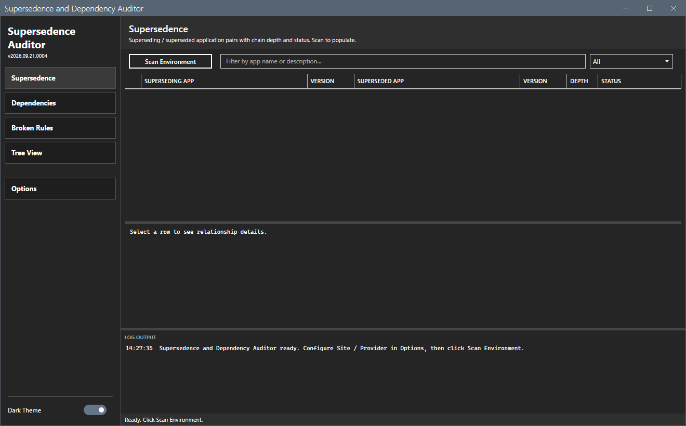

# Supersedence and Dependency Auditor

A MahApps.Metro WPF tool for auditing every application supersedence and dependency relationship in an MECM (Configuration Manager) environment. Retrieves all applications in a single bulk `Get-CMApplication` call and parses the embedded SDMPackageXML to resolve every relationship entirely in-memory. Detects broken rules and visualizes hierarchies in a tree view. Read-only by design: only `Get-CMSite` and `Get-CMApplication` are called, never any `Set-` / `New-` / `Remove-` / `Add-` cmdlet.



## Requirements

- Windows 10/11
- PowerShell 5.1
- .NET Framework 4.7.2+
- Configuration Manager console installed (provides the ConfigurationManager PowerShell module)
- Network access to the SMS Provider server (via CM PSDrive)

MahApps.Metro DLLs ship in `Lib/`; no NuGet, no network pulls at runtime.

## Quick Start

```powershell
powershell -ExecutionPolicy Bypass -File start-supersedenceauditor.ps1
```

1. Click **Options** in the sidebar and set your Site Code and SMS Provider
2. Click **Scan Environment** at the top of the content area
3. Use the sidebar to switch between Supersedence, Dependencies, Broken Rules, and Tree View

## Features

### Bulk Discovery via SDMPackageXML

Uses a single bulk `Get-CMApplication` call (without `-Fast`) to retrieve all applications with their embedded `SDMPackageXML`. Supersedence and dependency relationships are extracted by parsing the XML in-memory using XPath -- zero additional provider round-trips. CI_IDs are resolved to friendly names via O(1) hashtable lookups.

### Supersedence Tab

Lists all supersedence relationships with:

- Superseding and superseded application names and versions
- Chain depth (how many levels deep the supersedence extends)
- Status (Healthy, Orphaned, Circular, Expired Target, Disabled Source)
- Detail panel with full app metadata on row selection

### Dependencies Tab

Lists all dependency relationships with:

- Parent and dependency application names and versions
- Dependency type (Required, Optional, App Dependency)
- Relationship level
- Status (Healthy, Orphaned, Expired Target, Disabled Target, Missing Content)
- Detail panel on row selection

### Broken Rules Tab

Unified view of all detected issues across both relationship types:

| Issue Type | Category | Severity | Description |
|---|---|---|---|
| Orphaned Reference | Both | Error | Relationship references a deleted application |
| Circular Chain | Supersedence | Error | Circular supersedence loop detected |
| Circular Dependency | Dependency | Error | Circular dependency loop detected |
| Expired Target | Both | Warning | Target application is retired/expired |
| Disabled Source | Supersedence | Warning | Superseding application is disabled |
| Disabled Target | Dependency | Warning | Dependency target is disabled |
| Missing Content | Dependency | Error | Dependency target has no distributed content |
| Undocumented | Both | Info | App has relationships but no Manufacturer set |

Each broken rule includes a remediation description in the detail panel.

### Tree View

Hierarchical visualization with two root nodes:

- **Supersedence Chains** -- expand to see newest-to-oldest supersedence hierarchy
- **Dependency Trees** -- expand to see what each app depends on

Each node is prefixed with a status glyph (check, x, warn, ellipsis) at theme foreground. Click any node to see full application details in the side panel.

### Filtering

- Text filter searches across app names and descriptions
- Status filter: All, Healthy, Broken / Warning, Error
- Filters apply to the currently active view

### Export

- **CSV** -- export the active tab's data to CSV
- **HTML** -- styled report with glyph-based severity (check / x / warn / ellipsis)
- **Copy Summary** -- plain text summary to clipboard (app count, rule counts, broken counts)

## Project Structure

```
supersedence-auditor/
  start-supersedenceauditor.ps1           # WPF shell
  MainWindow.xaml                         # WPF layout (sidebar, views, log drawer)
  Lib/                                    # MahApps.Metro vendored DLLs
  Module/
    SupersedenceAuditorCommon.psd1        # Module manifest
    SupersedenceAuditorCommon.psm1        # Business logic (18 exported functions)
  Logs/                                   # Session logs (gitignored)
  Reports/                                # Export output (gitignored)
  SupersedenceAuditor.prefs.json          # User preferences (gitignored)
  SupersedenceAuditor.windowstate.json    # Window state (gitignored)
  CHANGELOG.md
  LICENSE
  README.md
```

## Module Functions

### Logging
- `Initialize-Logging` -- create timestamped log file
- `Write-Log` -- severity-tagged log messages (INFO/WARN/ERROR)

### CM Connection
- `Connect-CMSite` -- import CM module, create PSDrive, verify connection
- `Disconnect-CMSite` -- restore original location
- `Test-CMConnection` -- check if connected

### CM Data Discovery
- `Get-AllApplicationSummary` -- load all apps via `Get-CMApplication` (with SDMPackageXML) into hashtable
- `Get-AllResolvedRelationships` -- parse SDMPackageXML to extract all supersedence and dependency relationships in-memory

### Analysis
- `Find-SupersedenceChains` -- extract and analyze supersedence pairs
- `Find-DependencyGroups` -- extract and classify dependencies
- `Find-BrokenSupersedence` -- detect broken supersedence rules
- `Find-BrokenDependencies` -- detect broken dependency rules
- `Find-UndocumentedRelationships` -- find poorly documented relationship participants
- `Get-ScanSummaryCounts` -- aggregate counts for summary cards

### Tree Building
- `Build-SupersedenceTree` -- nested hierarchy for supersedence chains
- `Build-DependencyTree` -- nested hierarchy for dependency trees

### Export
- `Export-AuditCsv` -- DataTable to CSV
- `Export-AuditHtml` -- DataTable to styled HTML report
- `New-AuditSummaryText` -- plain text summary for clipboard

## Safety

- The shell calls only `Get-CMSite` and `Get-CMApplication` against the SMS Provider. No `Set-` / `New-` / `Remove-` / `Add-` cmdlets are referenced anywhere in the module or the WPF shell.
- All work after the bulk query happens against in-memory PSCustomObjects parsed from `SDMPackageXML`. Zero per-app provider round-trips.
- Filesystem writes are local-only: log files in `Logs/`, prefs JSON, window state JSON, optional CSV / HTML reports under `Reports/`.

## License

This project is licensed under the [MIT License](LICENSE).

## Author

Jason Ulbright
